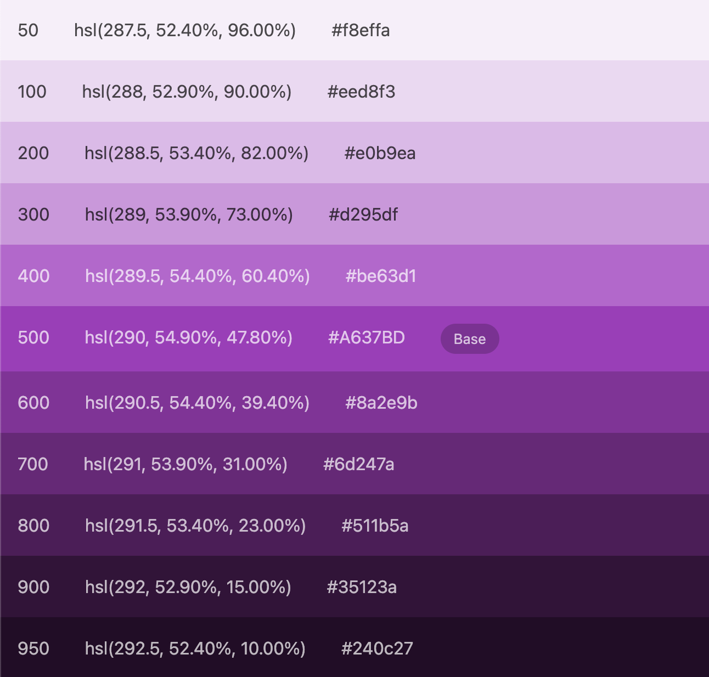

# Generate Color Palette
Tool that helps creating a complete color scale, like [Tailwind does](https://tailwindcss.com/docs/customizing-colors#naming-your-colors). written in Vanilla JS.



## What's inside
- node server
- Vanilla JS
- bootstrap + scss
- webpack config

## Launch
``` shell
npm i -g npm-check-updates
ncu -u
npm install
```
Then
```shell
npm start # starts app on port 3000
```

